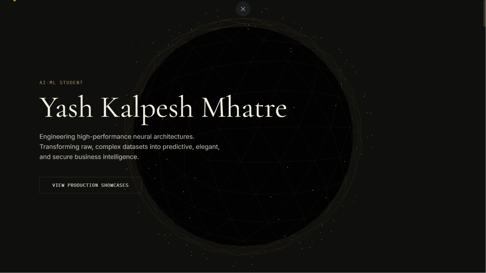
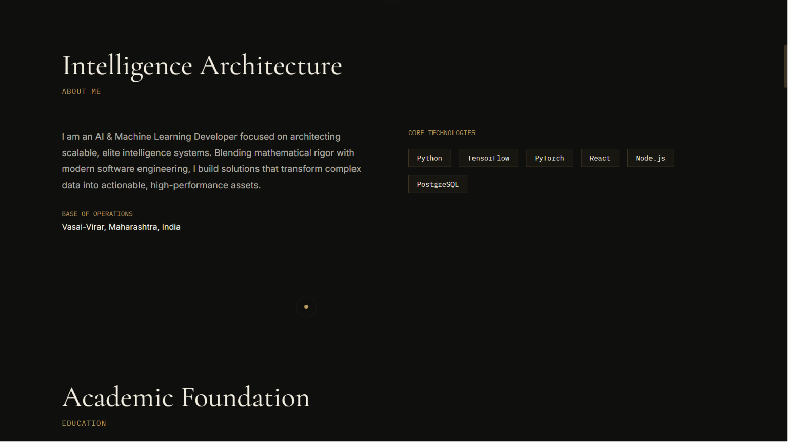
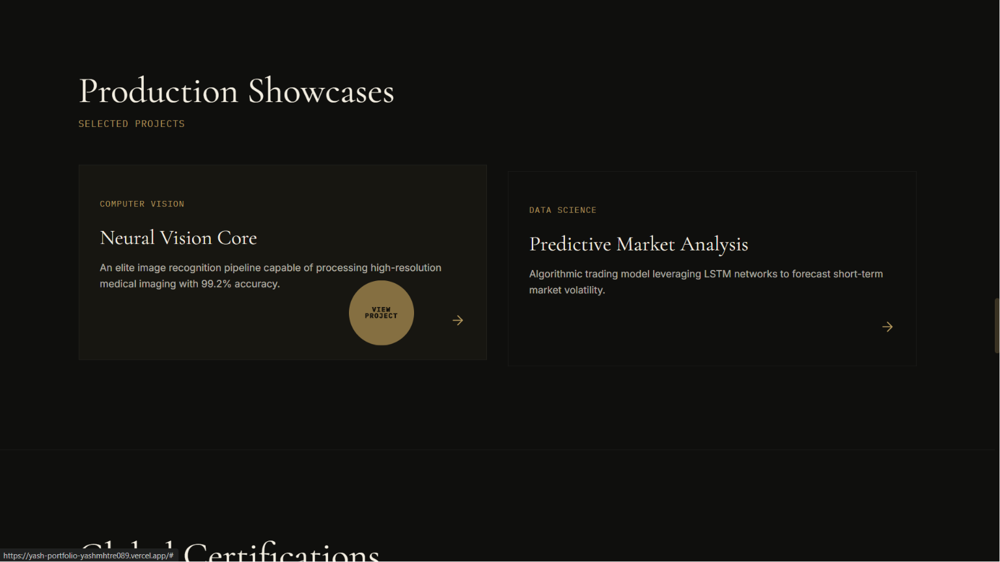
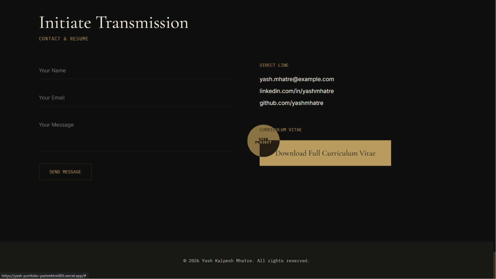
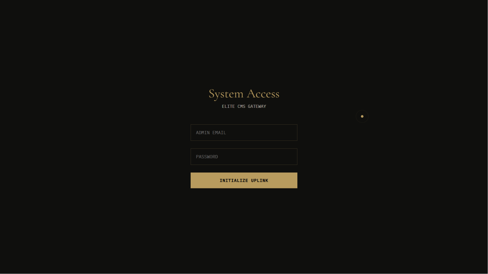

# 🚀 Yash Kalpesh Mhatre | Premium 3D Portfolio

[](https://yash-portfolio-yashmhtre089.vercel.app)
[](#)
[](#)

Welcome to my full-stack developer portfolio! This project goes beyond a standard static website by integrating high-performance 3D graphics (WebGL) and a custom secure backend for dynamic content management.

---

## 📸 Desktop Showcase

### 🌌 Immersive 3D Hero Environment

*Built with Three.js and React Three Fiber for a premium interactive experience.*

### 👨‍💻 Skills & Expertise

*Modern UI design showcasing core technical competencies.*

### 💻 Dynamic Projects Gallery

*Fully responsive grid optimized for performance and clean UX.*

### 📬 Contact & Connect

*Integrated contact flow to easily get in touch.*

### 🔐 Custom Admin Control Panel

*A secure Node.js backend allowing authorized editors to update the site on the fly.*

---

## 🛠️ The Tech Stack

### Frontend (Client)
* **Framework:** React.js & Vite
* **3D Rendering:** Three.js / React Three Fiber
* **Deployment:** Vercel

### Backend (Server)
* **Runtime:** Node.js & Express.js
* **Security:** JWT Authentication & Custom CORS
* **Deployment:** Render

---

## 🚀 Live Demo

**Check out the live production build here:** 👉 **[yash-portfolio-yashmhtre089.vercel.app](https://yash-portfolio-yashmhtre089.vercel.app)**

---

## 💻 Local Setup 

Want to run this locally? Follow these quick steps to boot up both the server and the client.

### 1. Clone the Repository
```bash
git clone https://github.com/yashmhatre089/yash-portfolio.git
cd yash-portfolio
### 2. Boot up the Backend (Server)
Bash
cd server
npm install
npm run dev
## Note: You will need a .env file in the server directory with PORT, MONGO_URI, and JWT_SECRET.
### 3. Boot up the Frontend (Client)
# Open a new terminal window, then run:

Bash
cd client
npm install
npm run dev
## Note: You will need a .env file in the client directory with VITE_API_URL=http://localhost:5000.

**Built with passion and late-night debugging. ☕**